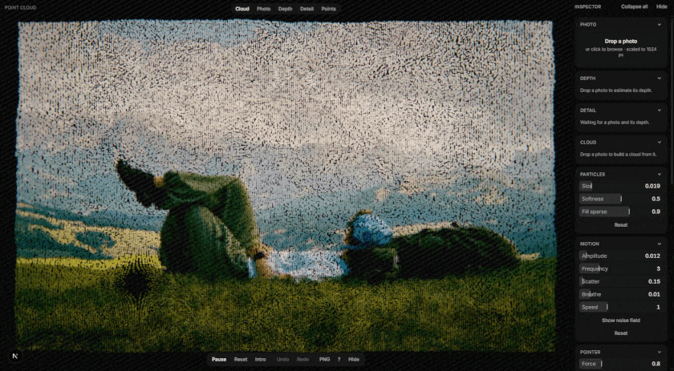

# point-cloud



<sup>Recorded live in the browser. Nothing here is pre-rendered: the depth map, the importance map and all 65,536 points are computed on the machine playing it.</sup>

**Drop a photograph in. Get a living point cloud out.** Everything happens in the browser — the depth estimation, the sampling, the rendering — and the result exports as a ~680 KB bundle you can drop into another project with one component.

Inspired by the particle hero of [UntilLabs](https://www.untillabs.com/) ([Codrops write-up](https://tympanus.net/codrops/2025/12/10/simulating-life-in-the-browser-creating-a-living-particle-system-for-the-untillabs-website/)), rebuilt from first principles — and then taken past it: the original was assembled by hand in Houdini, this does the whole pipeline live and adds pointer interaction the original does not have.

> **Status: complete.** All ten phases of the [roadmap](docs/roadmap.md) are done, 201 tests pass, and the only thing left unrun is the deploy. Start at [`docs/status.md`](docs/status.md).

## What it does

```
photo ─▶ depth ─▶ importance ─▶ 65,536 points ─▶ 2.5D cloud ─▶ three textures
        Depth      luminance     blue-noise      z = depth      colour · position
        Anything   gradient +    importance      × 3% relief    hi/lo · crowding
        V2 Small   contrast +    sampling                            │
        (worker)   depth edges                                       ▼
                                                            the renderer that has
                                                            read exactly this
                                                            format since P3
```

Every stage is visible: press `2`, `3`, `4`, `5` to look at the photo, the depth map, the importance map, and where the points actually landed.

| | |
|---|---|
| **Depth without a server** | [Depth Anything V2 Small](https://huggingface.co/onnx-community/depth-anything-v2-small) through transformers.js, WebGPU with a WASM fallback, in a Web Worker. The photo never leaves the device. A painter's-cue heuristic runs first so nothing waits on the download. |
| **Points where they matter** | Mitchell's best-candidate sampling over an importance map, scored `d²·w` so density follows the map instead of flattening out — dense on a face, sparse and evenly spaced on flat sky. |
| **A photograph, not a 3D model** | 2.5D relief of about 3% of the width, shot through a 16° telephoto. Shallow relief is what makes an imperfect depth map read as a photograph rather than a bad reconstruction. |
| **One draw call** | 65,536 particles, one `GL_POINTS` call. Position, colour and crowding are all vertex texture fetches; the motion is stateless curl noise recomputed from `uTime` every frame. |
| **Push it around** | A GPGPU ping-pong pass holds a per-particle displacement, so the cursor opens a hole in the cloud and it settles back. |
| **A real tool** | Schema-driven inspector, undo/redo with one step per drag, presets that survive a reload, and sliders that reach the GPU without React ever learning about it. |

## Try it

Requirements: **Node.js ≥ 22** and **Bun 1.3.14+**.

```bash
bun install
bun run dev            # the tool on http://localhost:3000
bun run storybook      # Atelier components on http://localhost:6006
```

Then:

1. **Drop a photo** on the Photo panel. Depth estimation starts immediately; the first run downloads 28–50 MB of model weights, after which the browser caches them.
2. **Watch it build** — or press `2`/`3`/`4`/`5` to step through the pipeline while it does.
3. **Tweak it.** Every knob is in the inspector; `Ctrl+Z` undoes a whole drag; the four built-in presets are a good place to start.
4. **Export** from the Export panel — a `.zip` with the measured size shown before you download it.
5. **Embed it** with `<ParticleImage>`, below.

`/embed` is a page that does step 5 against the sample cloud, importing nothing from the studio.

## Using a cloud somewhere else

Unzip an export into your own `public/particles/my-cloud/` and:

```tsx
import { Canvas } from "@react-three/fiber";
import { ParticleImage } from "@atelier/particle-image";

<Canvas camera={{ position: [0, 0, 8], fov: 16 }}>
  <ParticleImage src="/particles/my-cloud" />
</Canvas>;
```

There is no import step, because the zip *is* the format the renderer reads — see [`docs/bundle-format.md`](docs/bundle-format.md). Props, camera advice and the reason the shaders are embedded as strings are in [`docs/particle-image.md`](docs/particle-image.md).

## Stack

| Area | Choice |
|---|---|
| App | [Next.js 16](https://nextjs.org) (App Router, Turbopack), React 19.2, TypeScript |
| 3D | [three.js](https://threejs.org) + [React Three Fiber](https://r3f.docs.pmnd.rs) + drei, hand-written GLSL |
| Depth | [transformers.js](https://huggingface.co/docs/transformers.js) — Depth Anything V2 Small on WebGPU, WASM fallback |
| UI | **Atelier** — our own kit on [Base UI](https://base-ui.com) + [Tailwind CSS v4](https://tailwindcss.com), in [Storybook](https://storybook.js.org) |
| State | Zustand — parameters read in the frame loop, never through React |
| Data | Hand-written PNG and ZIP codecs (a canvas would corrupt coordinate data), [zod](https://zod.dev) on import |
| Tooling | Bun workspaces, Vitest, ESLint, Prettier |

## Repository layout

```
apps/point-cloud/
  src/app/shell/        viewport, floating toolbar, help sheet, stage views
  src/app/inspector/    panels built from the parameter schema
  src/params/           the schema: one entry per knob, read by UI, shaders and export
  src/photo/            the P6 pipeline — decode, depth, importance, sampling, packing
  src/photo/depth/      Depth Anything V2 and the painter's-cue fallback
  src/bundle/           PNG/ZIP codecs, metadata schema, export and import
  src/scene/            R3F scene: particle field, post pass, pointer simulation
  src/shaders/          GLSL, shared through registered ShaderChunks
  src/store/            params (+ history), photo pipeline, session, UI
  scripts/              sample bundle, LUT baking, shader embedding
packages/
  particle-image/       @atelier/particle-image — the drop-in component
  tokens/               @atelier/tokens — CSS variables + Tailwind @theme
  ui/                   @atelier/ui — Button, Slider, Panel, FileDrop, Kbd
docs/                   status, roadmap, format specs, research, learning notes
```

## Scripts

Run from the repository root.

| Command | What it does |
|---|---|
| `bun run dev` | Start the dev server |
| `bun run build` | Production build of every package that has one |
| `bun run start` | Serve the production build |
| `bun run storybook` / `build-storybook` | Atelier components |
| `bun run typecheck` · `lint` · `test` | TypeScript, ESLint, Vitest across all packages |
| `bun run format` / `format:check` | Prettier |

From `apps/point-cloud`:

| Command | What it does |
|---|---|
| `bun run build:sample` | Regenerate the committed sample bundle from `color.png` |
| `bun run build:luts` | Bake the colour grades into 512² LUT PNGs |
| `bun run build:particle-image` | Embed the shaders into the drop-in component |

## Documentation

- **[Status & handoff](docs/status.md)** — where things stand, what is outstanding, and a long list of things that will bite. **Start here.**
- **[Roadmap](docs/roadmap.md)** — P0–P9, each split into steps with what they teach and how to verify them.
- **[Bundle format](docs/bundle-format.md)** — what an export contains and why it is a zip of the folder the renderer already reads.
- **[`<ParticleImage>`](docs/particle-image.md)** — putting a cloud in your own project.
- **[Deploying](docs/deploy.md)** — the Vercel settings a Bun monorepo does not imply, and why COOP/COEP must stay off.
- **[Research: the UntilLabs method](docs/research/01-untillabs-method.md)** — what the article says versus what the shipped shaders and data actually do. *(Vietnamese)*
- **[Learning notes](docs/learn/README.md)** — one note per roadmap step: concepts from first principles, a walk through the real code, mistakes made honestly, exercises. *(Vietnamese)*

The learning notes are the point of this repository as much as the app is. Several of them are built around a bug rather than a feature — a red test that turned out to be a design fault, a shader define that quietly reset a material, a flag set by a one-shot event.

## Conventions

- Commits follow [Conventional Commits](https://www.conventionalcommits.org/en/v1.0.0/) — types, scopes and rules in [`CLAUDE.md`](CLAUDE.md).
- Every Atelier component ships with a story next to it; every roadmap step ships with a learning note.
- Code, comments and commits in English; learning notes in Vietnamese.

## Notes

- **React is pinned to 19.2** because `@react-three/fiber` 9.7 does not support 19.3 yet.
- **three.js is pinned to 0.182** because r183 deprecated `THREE.Clock`, which fiber 9.7 still uses.
- **Shaders** are plain `.glsl` files imported as strings through `raw-loader`; the drop-in component gets them embedded instead, because a stranger's bundler will not be configured for that.
- **The model needs the network on first use** — weights from Hugging Face, wasm from jsDelivr. Offline, the app falls back to painter's cues and says so.
- A hydration warning mentioning `bis_skin_checked` in dev comes from a browser extension, not from the app.
