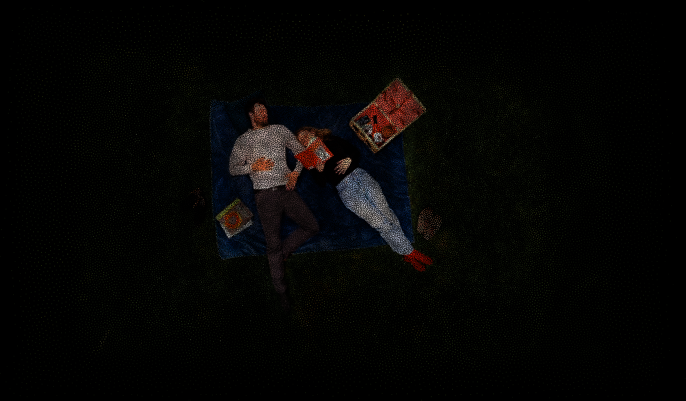
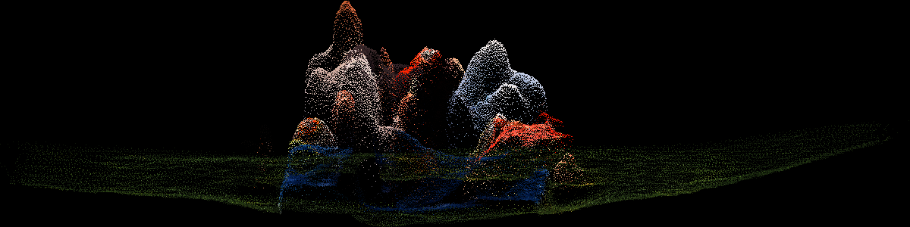
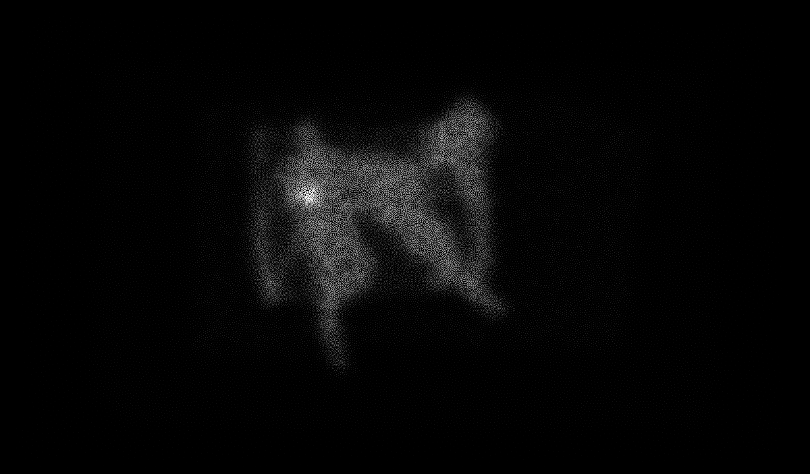

# Phương pháp UntilLabs: bài viết nói gì và bản production thật làm gì

Nguồn:
- Bài viết: [Codrops, 10/12/2025, Bautista Berto (basement.studio)](https://tympanus.net/codrops/2025/12/10/simulating-life-in-the-browser-creating-a-living-particle-system-for-the-untillabs-website/)
- Bản production: bundle JS và dữ liệu hạt tải từ `untillabs.com` ngày 2026-09-22 (các chunk Next.js/Turbopack, `/particles-data/*`, `/textures/LUT.png`)

Bài viết chỉ tóm lược, và phần demo trong bài (60k hạt trong khối cầu, lắc bằng `sin`) chỉ là giàn giáo để giảng giải. Để biết họ thực sự làm gì, tôi đã đọc shader production và giải mã texture dữ liệu. Tài liệu này ghi lại **cả hai**, và đánh dấu rõ những chỗ bài viết khác với thực tế.

---

## 1. Tóm tắt một đoạn

Một **bức ảnh chụp từ trên xuống** (hai người nằm trên tấm chăn giữa bãi cỏ) được dựng thành đám điểm 2.5D trong Houdini. Mật độ điểm dày ở chủ thể và thưa ở nền. Đám điểm được đóng gói thành **các PNG 256×256** (vị trí 16-bit tách thành hai ảnh byte cao và byte thấp, màu, mật độ), tổng cộng khoảng 600 KB. Trên web, một `THREE.Points` duy nhất với **vertex shader không trạng thái (stateless)** tự đọc texture, dựng lại vị trí, rồi cộng thêm chuyển động bằng **curl noise dựng trên fBM** tính trong clip space. Fragment shader vẽ đĩa tròn, áp **LUT** màu, và giả lập **độ sâu trường ảnh (DOF)** bằng cách thu nhỏ hạt và giảm alpha theo một "vòng tiêu cự" có mép hữu cơ nở dần ra. Toàn cảnh được render vào một render target (FBO), sau đó qua một quad hậu kỳ (blur viền theo đĩa Vogel, vignette, chỉnh màu).

**Không có mô phỏng vật lý thật, không có FBO ping-pong/GPGPU, không có tương tác chuột với hạt.** Cảm giác "sống" đến hoàn toàn từ noise tất định theo thời gian.

---

## 2. Dữ liệu: bức ảnh trở thành đám điểm như thế nào

### 2.1 Giải mã texture thật

Tôi giải mã `position_h/l.png`, `color2.png`, `density.png` bằng đúng công thức trong shader (script nằm ở scratchpad, xem mục 8):

| Nhìn từ trên xuống (mặt phẳng XZ, tô màu theo hạt) | Nhìn ngang (trục X–Y, phóng to theo chiều cao) |
|---|---|
|  |  |

Bản đồ mật độ (mặt phẳng XZ):



### 2.2 Những gì dữ liệu cho thấy

| Quan sát | Số liệu | Hệ quả |
|---|---|---|
| Ảnh gốc là **ảnh chụp từ trên xuống**, sau đó xoay `rotation=[π/2,0,0]` để quay mặt về camera | bounds X ≈ 244, Z ≈ 143 | Đây là một "tấm ảnh nổi", không phải một cảnh 3D đầy đủ |
| **Độ nổi (relief) rất nông** | Y chỉ dày **≈ 1.4 đơn vị**, tức khoảng 0.6% chiều rộng | Chỉ cần độ sâu tương đối. Kết hợp FOV hẹp, sai số độ sâu gần như không lộ ra |
| **Lấy mẫu theo tầm quan trọng (importance sampling)** | 65 536 điểm, dày ở người, thưa ở cỏ | Chi tiết đổ vào chủ thể, nền chỉ còn một lớp bụi mịn |
| Kênh `density` là **mật độ điểm cục bộ** | `densityRange` 0.0002 → 7.33 (đã chuẩn hoá về 0–1 trong PNG) | Shader dùng giá trị này để **phóng to hạt ở vùng thưa**, nhờ vậy nền không bị lủng lỗ |
| Thứ tự điểm trong texture là **ngẫu nhiên** | corr(index, x) ≈ 0.003 | Texel kề nhau không phải điểm kề nhau. Chỉ số điểm dùng làm seed ngẫu nhiên được |
| Màu có alpha luôn bằng 255 | | Alpha thực ra đến từ shader |
| Comment trong code: *"Invert Y axis to match Houdini coordinate system"* | | Công cụ dựng đám điểm là **Houdini** (bài viết chỉ nói "any 3D Point Cloud tool") |

### 2.3 Đóng gói vào texture (thay cho JSON 20 MB)

```
position_h.png  RGB = byte cao của X,Y,Z (16-bit)   256×256, Nearest, no mipmap, flipY=false
position_l.png  RGB = byte thấp của X,Y,Z
color2.png      RGB = màu
density.png     R   = mật độ (RedFormat)
metadata2.json  { width, height, particleCount, bounds{min,max}, densityRange }
```

Giải mã trong vertex shader:

```glsl
vec3 hi = texture2D(uParticlesPositionHigh, aParticleUv).xyz * 255.0;
vec3 lo = texture2D(uParticlesPositionLow,  aParticleUv).xyz * 255.0;
vec3 n  = (hi * 256.0 + lo) / 65536.0;          // 0..1
vec3 p  = n * (boundsMax - boundsMin) + boundsMin;
p.y = -p.y;
```

> ⚠️ **Một điểm kỳ quặc trong code gốc:** shader viết `colorRange = uTextureSize - 1.` và `/ uParticleCount`. Công thức chỉ đúng vì texture tình cờ là 256×256 (256 − 1 = 255, và 256² = 65536 = 2¹⁶). Nếu đổi kích thước texture, vị trí sẽ sai. Khi tự viết lại, hãy hard-code 255, 256 và 65535.

Geometry không chứa vị trí thật: attribute `position` toàn số 0, chỉ có `aParticleUv` (tâm texel) và `aIndex`. Vì vậy phải đặt `frustumCulled = false`.

---

## 3. Chuyển động: "sống" mà không cần mô phỏng

Toàn bộ nằm trong vertex shader, **không có trạng thái giữa các frame**:

1. **Curl noise 2D dựng trên fBM** (value noise, 5 octave, xoay 0.5 rad mỗi octave để giảm thiên lệch theo trục). Hàm này nhận **UV cộng index của hạt làm đầu vào**, không nhận vị trí, nên mỗi hạt đi một quỹ đạo riêng:
   ```glsl
   vec2 c = curlNoise(aParticleUv + aIndex*0.01, uTime);   // bên trong cộng time*0.1
   gl_Position.yx += c * uNoiseFactor * perspectiveScale;  // uNoiseFactor = 2
   ```
   Độ dịch được cộng **sau phép chiếu**, trong clip space. Vì thế hạt lắc theo pixel màn hình, đều nhau bất kể độ sâu. Họ cũng hoán đổi `.yx`.
2. **Dao động theo trục Z**, chỉ bật khi camera ở gần (`smoothstep(50,20,camDist)`): `sin(t*0.5 + index*3.1*fbm(...)) * 10.5`.
3. Không có lực, không có vận tốc, không có mô phỏng Brownian thật. Chữ "Brownian" trong bài chỉ là cách ví von cho fBM.

**Vì sao cách này hiệu quả:** O(1) mỗi hạt, không cần FBO mô phỏng, không có sai số tích luỹ, chạy mượt trên mobile. **Cái giá phải trả:** không thể có tương tác thật như đẩy hạt bằng chuột, hạt tụ lại hay tán ra theo quán tính.

---

## 4. Kích thước và độ trong của hạt

Vertex shader:

```glsl
perspectiveScale = clamp(300*uScreenScale / camDist, 0.3, 2.5) * densityScaler;
smoothScale      = mix(3.0, 1.0, smoothstep(80, 400, camDist));
gl_PointSize     = (2.2 / uScreenScale) * smoothScale * perspectiveScale + vEdgeFactor*10;
gl_PointSize    -= gl_PointSize * vFocalTransition² * 1.6;   // ngoài vùng nét thì nhỏ lại
```

- `uScreenScale = 0.05 * (1920 / viewportHeight) / dpr`: giữ kích thước hạt ổn định bất kể độ phân giải.
- `densityScaler`: mật độ < 0.3 cho hạt to 1.3→1.0; ngược lại cho 0.6. Vùng thưa có hạt to hơn để phủ kín.
- `vEdgeFactor`: hạt ở hai mép trái/phải (theo X) to ra, mờ đi và bị đẩy giãn ra ngoài một chút (`gl_Position.x *= 1 + edge*0.3`). Hiệu ứng giống bokeh ở rìa khung.
- `vDepthFactor = smoothstep(10, 50, camDist)`: hạt quá sát camera sẽ mờ đi.

Fragment shader:

```glsl
vec2 c = gl_PointCoord - 0.5; if (dot(c,c) > 0.25) discard;   // đĩa tròn
alpha = clamp(1 - dist*3, 0.8, 1.0);                          // lõi đặc, mép mềm nhẹ
color = mix(orig, LUT(orig), 0.8) * 0.9;
color.a *= alpha³ * focalTransition + 0.05;  *= depthFactor;  *= 1 - edgeFactor;
```

Material: `transparent`, `depthWrite: false`, blending thường (**không phải additive**), không sắp xếp hạt, dùng `polygonOffset`.

---

## 5. Hiệu ứng mở màn và "tiêu cự"

- **Camera lùi vào:** GSAP đưa camera từ z = 900 về `(15.7, 10, 350)`. Camera có **FOV = 16°** (tele), `near 0.01`, `far 1000`. FOV hẹp làm phối cảnh phẳng đi, nhờ vậy đám điểm có độ nổi nông trông vẫn như ảnh thật mà chỉ hơi có khối.
- **Hạt hiện dần lệch pha:** `uInitProgress` chạy 0→1 bằng GSAP. Mỗi hạt có độ trễ riêng, trộn từ `random(uv, index)` và `fbm(uv*2)` với tỉ lệ 0.4, nên hạt hiện lên theo từng mảng hữu cơ chứ không đồng loạt.
- **Vòng tiêu cự nở ra:** bán kính tăng theo thời gian (`animTime * 40`), mép vòng bị méo bởi `fbm(góc, bán kính)` cộng sóng `sin(angle*6)` cộng drift, và thêm noise mạnh khi bán kính vượt 15. Hạt nằm ngoài vòng sẽ nhỏ lại và trong suốt dần. Kết quả trông như ống kính đang lấy nét dần từ tâm ra ngoài.

---

## 6. Pipeline render và hậu kỳ

```
contentScene ──render──▶ WebGLRenderTarget (full-res × dpr; Float, riêng mobile dùng HalfFloat)
                               │
                               ▼
                 Fullscreen quad (QuadShader, priority 1)
                  1. blur viền: sdBox(uv-0.5, (0.2,0.3)) → bán kính 0..10 px,
                     16 mẫu đĩa Vogel (golden angle), trọng số Gauss
                     (chỉ bật khi quality ≥ MEDIUM)
                  2. vignette: pow(uv.x*uv.y*20, 0.1)
                  3. nhân hệ số màu (0.8, 0.84, 0.93) ở đầu và cuối trang
                  4. tonemapping + colorspace của three
```

- **LUT** là ảnh 512×512 chuẩn (64³ màu xếp thành lưới 8×8 ô), hàm `lookup()` kinh điển. Bài viết nói LUT nằm ở bước hậu kỳ, nhưng trong code **LUT được áp ngay trong shader của hạt** (mix 0.8). Shader hậu kỳ có khai báo `uLookup` nhưng không hề gọi đến.
- Nền: một plane gradient riêng (xanh rêu tối → đỏ/xanh dương theo scroll) cộng Perlin noise hạt mịn. Cảnh còn thêm một lớp điểm "trees" 128×128 (vị trí 8-bit, dùng shader khác) và các khối cầu, lục giác ở những đoạn scroll sau.
- Công nghệ: Next.js, React Three Fiber, drei, GSAP, Leva (panel chỉnh thông số), Zustand (lưu scroll progress).

---

## 7. Bài viết khác bản thật ở đâu

| Bài viết nói | Thực tế trong code |
|---|---|
| 60k hạt trong khối cầu, lắc bằng `sin` | Chỉ là demo. Production dùng 65 536 hạt giải mã từ texture |
| "Physics-driven", "Brownian motion" | Không có vật lý. Chỉ có curl-fBM tất định theo thời gian, cộng trong clip space |
| FBO để làm post-processing | Đúng, nhưng **không có** FBO mô phỏng hay ping-pong |
| LUT ở bước hậu kỳ | LUT được áp trong fragment shader của hạt |
| "Any 3D Point Cloud tool" | Houdini, lấy mẫu theo mật độ, độ nổi rất nông |
| Không nhắc tới | Kích thước hạt theo mật độ, DOF giả trong shader hạt, vòng tiêu cự, bokeh mép, FOV 16°, reveal lệch pha |
| Công thức 16-bit dùng `uTextureSize` và `uParticleCount` | Chỉ đúng khi texture là 256² |

---

## 8. Áp vào dự án của mình

UntilLabs có **một** bức ảnh và một artist Houdini làm tay. Dự án này (theo hướng trước khi reset: người dùng thả ảnh vào, model độ sâu chạy trong trình duyệt, ra đám điểm) cần **tự động hoá** phần mà họ làm offline:

```
Ảnh ─▶ Depth (monocular, WebGPU/WASM worker) ─▶ Lấy mẫu theo tầm quan trọng ─▶ Đóng gói vào texture ─▶ Points shader ─▶ FBO ─▶ Hậu kỳ
            độ sâu tương đối là đủ             (saliency/cạnh/độ tương phản       (Float/RGBA32F luôn,
            (độ nổi chỉ ~1–5% bề rộng)          × blue-noise / Poisson)             không cần tách hi/lo
                                                 → mật độ cục bộ → kích thước hạt    vì dữ liệu sinh tại chỗ)
```

Những điều rút ra:

1. **Độ nổi nông cộng FOV hẹp là bí quyết chính.** Độ sâu monocular thường sai về tỉ lệ tuyệt đối, nhưng với relief khoảng 1–5% thì sai số ấy không lộ ra. Nên giữ tham số relief ở mức nhỏ.
2. **Lấy mẫu theo tầm quan trọng quan trọng hơn số lượng hạt.** 65k điểm đặt đúng chỗ đẹp hơn 500k điểm rải đều. Trọng số có thể lấy từ độ lớn gradient, saliency, hoặc độ chênh độ sâu, rồi lấy mẫu bằng blue noise để hạt không vón cục.
3. **Mật độ nên điều khiển kích thước hạt**, để nền thưa vẫn phủ kín, không thành lỗ đen.
4. Việc tách vị trí thành hai PNG byte cao/thấp **chỉ cần khi ship dữ liệu tĩnh**. Dữ liệu sinh ngay trong trình duyệt thì dùng thẳng `DataTexture` Float.
5. **Chuyển động không trạng thái là đủ** để có cảm giác sống. Nếu muốn **tương tác** (chuột đẩy hạt, hạt tụ lại hay tán ra), phải thêm một tầng GPGPU ping-pong. Bản gốc **không có** tầng này, nên đây sẽ là điểm vượt trội của mình, và cũng là phần phức tạp nhất.
6. DOF giả trong shader hạt (thu nhỏ hạt, giảm alpha) rẻ hơn nhiều so với DOF hậu kỳ thật. Blur hậu kỳ chỉ cần ở mép khung.

### Các quyết định cần chốt trước khi code

- **Nền tảng:** React Three Fiber (giống bản gốc, dễ đưa vào UI React) hay three.js thuần (gọn, kiểm soát vòng render tốt hơn)?
- **Nguồn ảnh:** người dùng tự tải lên (cần model độ sâu trong trình duyệt), hay dựng sẵn vài cảnh offline (đơn giản như UntilLabs)?
- **Tương tác:** chỉ chuyển động không trạng thái (giống bản gốc), hay thêm GPGPU để chuột tác động được lên hạt?
- **Phạm vi:** một hero section kiểu landing page (có scroll và camera chạy theo kịch bản), hay một studio/tool để chỉnh tham số?

---

### Phụ lục: tái hiện kết quả phân tích

Các file tạm (không commit) nằm trong scratchpad của phiên này:
- `chunks/bbb37fb4a48288ff.js`: chunk chứa toàn bộ scene hạt
- `shaders.glsl`: shader được trích từ chunk
- `data/main-scene/*`, `data/trees/*`, `data/LUT.png`: dữ liệu gốc
- `decode.py`: script giải mã texture thành 3 ảnh preview ở trên
